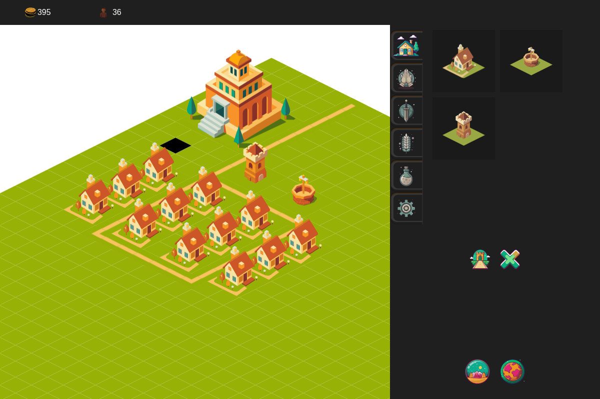

# Nimrod - Isometric City Builder


[](https://nimrod.pages.dev)

## General Info
Nimrod is an isometric city builder game inspired by *Zeus: Master of Olympus* with tactical combat elements reminiscent of *Fire Emblem*. Built purely with TypeScript, featuring:

- Production chains and resource management
- Population dynamics with happiness and workforce systems
- Tactical grid-based combat system



**Live Demo:** [nimrod.pages.dev](https://nimrod.pages.dev)

## Table of Contents
- [General Info](#general-info)
- [Technologies](#technologies)
- [Setup](#local-setup)

## Technologies
- TypeScript
- HTML5 Canvas API
- Jest for testing

## Local Setup
```bash
# Clone repository
git clone https://github.com/xpakx/nimrod.git
cd nimrod

# Install dependencies
npm install

# Build project
npm run build

# Run dev server
npm run serve
```
